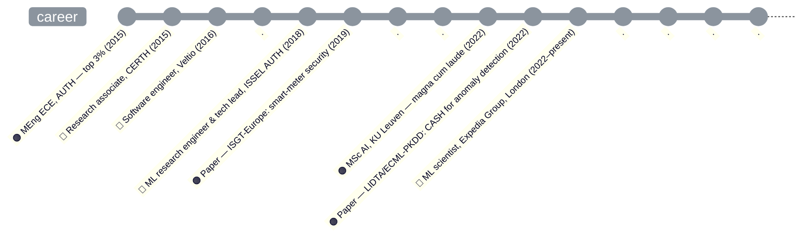

# About me

I'm **trying to optimize** a notoriously **complex loss function**, navigating a **high-dimensional, non-convex** landscape—**one small step at a time**. Probably, so are you!

**My learnings from this winding journey:**

- **Choose your objective with caution**—you drift toward whatever you optimize.
- **Curate what you train on**—you learn from what you keep feeding yourself.
- **Set the pace**—bold enough to move, small enough not to overshoot.
- **Favour signal over noise**—small, informative steps beat thrashing.
- **Rein in the extremes**—when gradients explode, nobody benefits.
- **Beware tunnel vision** (overfitting)—a little **regularization** keeps you adaptable.
- **Use momentum**—keep going; let earlier progress carry you through flat stretches.

## Education

I hold an **MEng in Electrical and Computer Engineering** (2015, top 3% of my class) from **Aristotle University of Thessaloniki**, Greece, and an **MSc in Artificial Intelligence** (2022, *magna cum laude*) from **KU Leuven**, Belgium. I was fortunate to learn from outstanding professors and mentors in **mathematics**, **physics**, **engineering**, and **computer science**.

I have authored two papers:

- [Antoniadis, I., Vercruyssen, V. and Davis, J. (2022). Systematic Evaluation of CASH Search Strategies for Unsupervised Anomaly Detection. Proceedings of the Fourth International Workshop on Learning with Imbalanced Domains: Theory and Applications, in Proceedings of Machine Learning Research 183:8–22.](https://proceedings.mlr.press/v183/antoniadis22a)
- [I. I. Antoniadis, K. C. Chatzidimitriou and A. L. Symeonidis, "Security and Privacy for Smart Meters: A Data-Driven Mapping Study," 2019 IEEE PES Innovative Smart Grid Technologies Europe (ISGT-Europe), Bucharest, Romania, 2019, pp. 1–5, doi: 10.1109/ISGTEurope.2019.8905611.](https://ieeexplore.ieee.org/document/8905611)

## Experience

My professional career started in **2015**, when I joined the [Centre for Research and Technology Hellas (CERTH)](https://www.iti.gr/iti/en/home/) as a **research associate** (Nov 2015–Jul 2016). There, I contributed to an EU-funded H2020 project on cloud computing—when the field was still in its early stages—and worked with a large consortium of European institutions.

I continued as a **software engineer** at [Veltio](https://veltio.com/) (Dec 2016–Jul 2018), an Oracle partner offering supply-chain automation solutions. I worked on real-world, large-scale problems alongside an exceptional team and led the development of data pipelines and systems used by major international retailers, including Sainsbury's in the UK.

I then joined the [Intelligent Systems and Software Engineering Lab (ISSEL)](https://issel.ee.auth.gr/en/13-2/) at the Department of Electrical and Computer Engineering, AUTH, as an **ML research engineer** (Oct 2018–Sep 2021). I was the technical lead on an EU-funded project on energy monitoring and load disaggregation: applied ML research, NLP pipelines (e.g. BERT, topic models), and a high-throughput event streaming engine for real-time smart-meter analytics.

In **September 2022** I joined [Expedia Group](https://www.expediagroup.com/home/default.aspx) in London as a **machine learning scientist**. On the Content & Relevance team I work on large-scale ranking and retrieval—reviews, amenities, and property understanding—using **deep learning**, LLMs, and **multimodal** methods. My recent work has included cross-brand review ranking, semantic relevance and distillation for low-latency embeddings, LLM-as-judge labelling, internal TensorFlow ranking frameworks shared across teams, distributed evaluation tooling, and research on bias, calibration, and data pruning.

*My first job was in 2011, during my second year at AUTH, as a part-time support representative at OTE, the largest telecommunications company in Greece.

## Career timeline

🔵 working experience · 🟠 degrees & papers

## What motivates me

I find it exciting to push human boundaries with technology, and I believe we have a responsibility to leave the world better for future generations.

*All it takes is one small step at a time!*

## Selected GitHub repositories

Past **side projects**, **coursework**, and **research code** live in separate repositories. Most of the older ones are **archived** on GitHub (read-only snapshots; not actively maintained) — the algorithm-visualiser portfolio below is the exception: it's active and still growing.

**[algorithm-visualizers](https://github.com/johnantonn/algorithm-visualizers)** ([live demo](https://algorithm-visualizers.streamlit.app/)) — 20 classic ML/CS algorithms, each a from-scratch NumPy implementation (no scikit-learn/PyTorch in the core algorithm) with an interactive step-by-step Streamlit + Plotly walkthrough, all in one categorised app:

- *Clustering* — K-Means, DBSCAN, Gaussian Mixture (EM)
- *Dimensionality reduction* — PCA, UMAP, t-SNE
- *Classification & ensembles* — Perceptron & Gradient Descent, Support Vector Machine, Random Forest
- *Deep learning building blocks* — Backpropagation, Transformer Self-Attention
- *Generative & self-supervised models* — Variational Autoencoder, Diffusion Model (DDPM), Contrastive Learning
- *Graph algorithms* — Dijkstra & A*, Minimum Spanning Tree
- *Probabilistic methods, state estimation & signal processing* — Markov Chain Monte Carlo, Kalman Filter, Fast Fourier Transform
- *Reinforcement learning* — Q-Learning / SARSA

**Personal notebooks & experiments** (self-directed; not part of a degree curriculum)

- [bias-variance-decomposition](https://github.com/johnantonn/bias-variance-decomposition) — bias–variance decomposition  
- [fair-binary-classification](https://github.com/johnantonn/fair-binary-classification) — fairness on Adult (AIF360)  
- [gaussian-bandits](https://github.com/johnantonn/gaussian-bandits) — multi-armed bandits  
- [example-level-gradient-analysis](https://github.com/johnantonn/example-level-gradient-analysis) — per-example gradients  
- [kepler-exoplanet-prediction](https://github.com/johnantonn/kepler-exoplanet-prediction) — Kepler / KOI classification notebook  
- [sorting](https://github.com/johnantonn/sorting) — Python sorting algorithms, pytest, benchmarks  

**KU Leuven — Master of Artificial Intelligence**

*Coursework*

- [cart](https://github.com/johnantonn/cart) — CART / decision trees  
- [grid-world-mdp](https://github.com/johnantonn/grid-world-mdp) — grid-world MDP, policy iteration  
- [taxi-rides-mapreduce](https://github.com/johnantonn/taxi-rides-mapreduce) — Hadoop MapReduce & Spark taxi analytics  
- [locality-sensitive-hashing](https://github.com/johnantonn/locality-sensitive-hashing) — LSH on Stack Overflow posts  

*Thesis & published research*

- [cash-for-unsupervised-ad](https://github.com/johnantonn/cash-for-unsupervised-ad) — Master’s thesis code extended to the **LIDTA 2022** (ECML/PKDD) paper: CASH / AutoML for unsupervised anomaly detection  

**Aristotle University**

*Diploma thesis*

- [insight-qa](https://github.com/johnantonn/insight-qa) — Semantic question answering (Java, Elasticsearch, LDA)  

*Coursework*

- [pagerank](https://github.com/johnantonn/pagerank), [octree-division](https://github.com/johnantonn/octree-division) — Parallel C (PageRank; octree spatial division)  

## Curriculum vitae

You can find my full CV [here](https://www.dropbox.com/scl/fi/8ivr3wr4eyzgz1rlop83s/iantoniadis_2026.pdf?rlkey=fkofbkvo55g7plw0ni17fajwk&dl=0).

## Contact

You can contact me by [email](mailto:ioannis.antoniadis.uk@gmail.com) or on [LinkedIn](https://www.linkedin.com/in/iantoniadis/).
